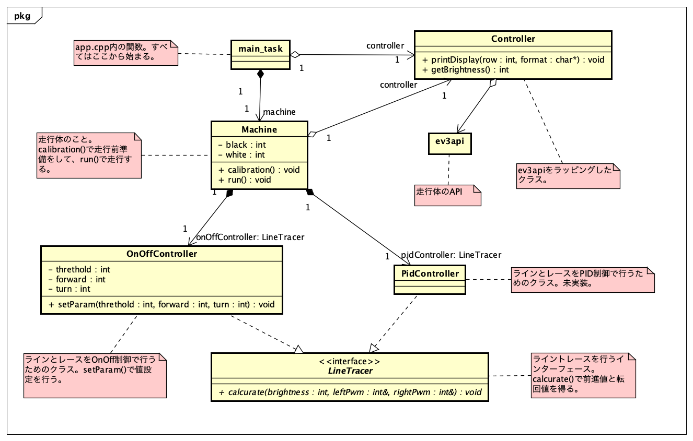

# etrobo-docker-devcontainer-template

VS Code Remote Developmentの機能を用いて、ETロボコンで使う`ev3rt`向けプログラムの開発環境を容易に構築するサンプルコードです。

ビルド環境は、[etrobo-docker](https://hub.docker.com/r/korosuke613/etrobo-docker/)を利用しています。

(**Dockerが必要です**)

## setup

1. `git clone https://github.com/korosuke613/etrobo-docker-vscode-devcontainer-sample.git`
2. VS Codeで`etrobo-docker-vscode-devcontainer-sample`を開く。
3. 拡張機能[Remote Development](https://marketplace.visualstudio.com/items?itemName=ms-vscode-remote.vscode-remote-extensionpack)を追加する。
4. 左下の`><`アイコンを押して、`Rebuild Container`を実行する。
5. 待つ。
6. ワークスペースが開いたら、terminalを開き、`./make.sh`を実行する。
7. 上手くビルドできたらsetup完了！

## build

```bash
./make.sh
```

`app`という実行ファイルができているはず。

## Sample program
サンプルプログラムのクラス図です。


